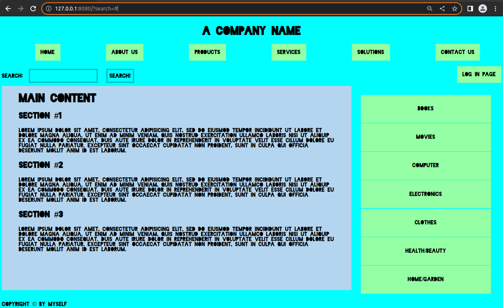

# 0003-basic-website-structure

**This is a one page website.**  
This simple design has responsive abilities.

This project was build using semantic HTML5 tags and media queries rules of modern CSS.

A screenshot of how the page looks like:

